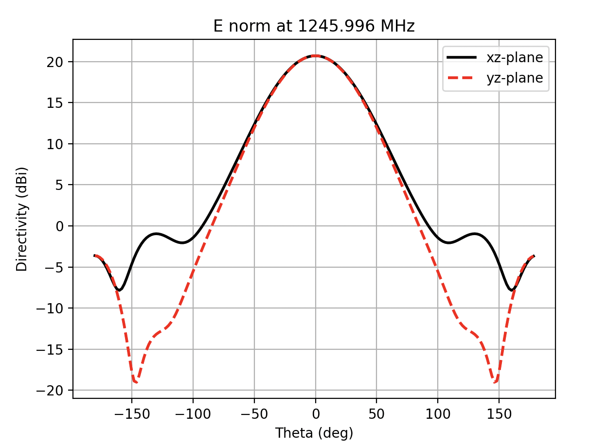
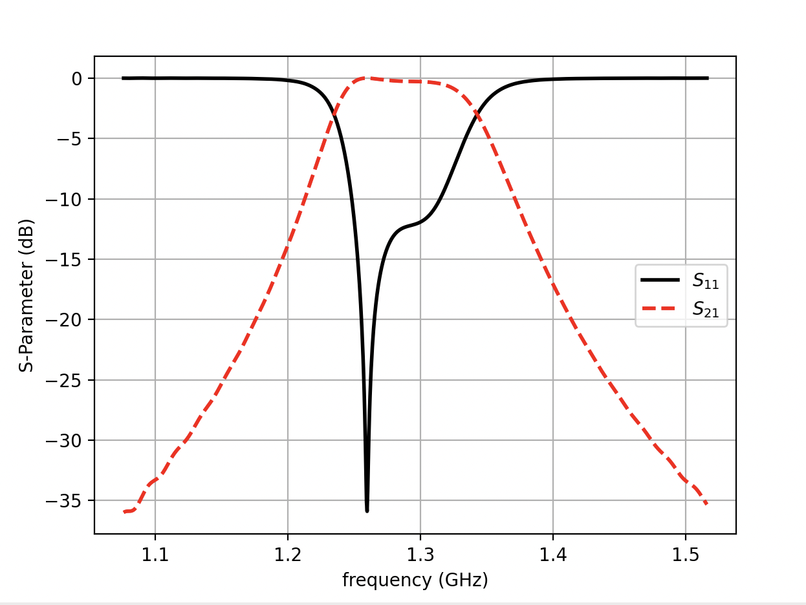

# Rfems

This script lets you run an openEMS FDTD simulation
simply from a collection of STL 3D models.  To use this script you need to
have openEMS installed as well as its Python API extension.  You 
will also need a method to generate the STL files that will compose your FDTD model.
The example models in this repo use Python and openscad to do this.  But you can use whatever you want.

## Why Rfems Was Created

I wanted to build parametric FDTD models, just like those created 
by FEKO and HFSS.  Specifically, I wanted to design and optimize cavity filters.
RSGB has a book called Microwave Knowhow which has a section
on physically building such filters.   The MYJ Microwave filters
book has a section (11.4) on physically designing microwave filters 
one symmetric section at a time to get correct coupling.
Nevertheless, despite the risk of falling into the trap of simulating instead of building,
learning FDTD seemed a better alternative to a constructing a machine shop.

To parametricly design and optimize a FDTD model without
FEKO or HFSS, I turned to Python and other common 3D printing tools.
Python has code for creating 3D models, letting me parametrically
adjust, for example, coupling distances and such of 3D models of cavity filters.
And since openEMS can import either STL or PLY formatted models, I picked STL as the
natural format.  (Only ASCII STL models are supported by rfems.  Binary STL models do not
provide a fine enough resolution).  The examples provided in the repo use the
solidpython2 library and openscad to create the STL files.

Another reason I created rfems was to test and validate my other repo called rffdtd.
Rffdtd was my first attempt at designing cavity filters using FDTD.  It also influenced
the design of this software wrapper around openEMS.

## How To Create a OpenEMS Simulation Using Rfems

To create a simulation, generate a STL for every material or solid that you want
to be modeled.  The name of the STL indicates the type of material that composes
that solid.  So a file named 'aluminum.stl' will be considered to model a aluminum
part.  Rfems has preset material names of silver, copper, gold, aluminum, brass,
steel, port, and air.  The material must start with this name.

Anything after this name will be considered a 'material variable'.
Material variables are key-value pairs separated by an equal sign.
To use a nonpreset material, with specific values for conductance and dielectic permittivity, use the
material variables kappa and epsilon.  For example, if your material has a conductance of 44.3e6
name your file 'kappa=44.3e6.stl'.  Otherwise, if no preset is used or no kappa or epsilon variables
are set, the material will be considered a perfect conductor, or PEC.

The port material is a special case.  Its STL model creates a lumped port in
openEMS.  The format of the port material is 'port {polarity} {port number}' where
polarity is either x, y, or z and port number starts from 1.
The lumped port's impedance defaults to the value provided
through the --line option.  Or you can set it directly using the 'zo' material
variable.  For example for a lumped port 1 with an impedance of 75 ohms use 'port x 1 zo=75'.
The bounding box of the STL model will be used as the lumped port's dimensions.

Multiple STL models using the same material
can be differentiated using labels: prefix the material with a label name and
then a dash, for example 'tee-aluminum.stl'.  In fact it is usually much easier to
create separate STL models for each component of the same material, like using
one STL model for each resonator in a cavity filter.  Sometimes it is 
even neccessary because of the limitation in openEMS.  For example a enclosure 
in openEMS must be have its lid, edges, and tops each in a separate file.  For a cup antenna the sides
of cups must be in a separate STL file than the bottom of the cup.  Using the option --dump
to check.

To set the priority of the material use the material variable 'priority'.  For example
to set the priority of an aluminum STL model to 10 use, 'aluminum priority=10'.  The
default priority for materials is 0, the lowest priority.  A conductive material 
lying on top of a substrate material should have a higher priority set, see patch.py.

All these models must be then zipped up into a single zip file.  This zip file is
presented to rfems as the complete model to simulate.  Nothing else
is needed.  To view the complete model use the --show option.

## S-parameter Support

After each simulation the s-parameter result is written out to a .npz numpy formatted
data file.  The s parameters are in the 's' variable, the frequency points are in
the 'f' variable.  The 'z' variable is an array of each port's characteristic impedance.

## Antenna Far Field Support

Rfems supports the generation of far field radiation patterns using the option
--farfield.  If the option --nominimum is NOT used, the far field pattern generated
is only for the frequency point of minimum VSWR.  Otherwise rfems computes the
far field patterns for all the simulation points. (The rfems default of 1000 frequency points
might take a while, so you probably want to change it.)
The radiation pattern is included in the .npz file output.
See the showresults.py file in the examples directory for the list of variables written
out (these are also the same variables generated by openEMS).

When enabling farfield, the boundary surrounding your model will switch from PEC
to MUR.  To put space between your antenna model and this MUR boundary create a STL model
and name it using the material name air.   See the examples, cup.py and patch.py for
examples of how this works.

## Dependencies

To run rfems:

1. openEMS binary libraries ($ apt-get install openems)
2. openEMS python libraries ($ apt-get install python3-openems)
3. numpy ($ pip install numpy)

To run the examples in the repo (optional):

1. solidpython2 ($ pip install solidpython2)
2. openscad ($ apt-get install openscad)

## Example

```
$ python examples/patch.py
$ python rfems.py examples/patch.zip --pitch .005 --frequency 2e9 --criteria -40 --threads $(nproc) --farfield
$ unzip -v examples/patch.zip
Archive:  examples/patch.zip
 Length   Method    Size  Cmpr    Date    Time   CRC-32   Name
--------  ------  ------- ---- ---------- ----- --------  ----
    1719  Defl:N      219  87% 01-01-1980 00:00 25ac1329  sim_box-air.stl
    1737  Defl:N      227  87% 01-01-1980 00:00 5c731105  patch-pec priority=10.stl
    1773  Defl:N      226  87% 01-01-1980 00:00 c8c5ab3c  ground-pec priority=10.stl
    1719  Defl:N      222  87% 01-01-1980 00:00 c798422e  substrate-epsilon=3.38 kappa=0.000460693.stl
    2025  Defl:N      233  89% 01-01-1980 00:00 8882aac7  port z 1.stl
--------          -------  ---                            -------
    8973             1127  87%                            5 files
$ python examples/showresult.py examples/patch.npz
```


```
$ python examples/inter.py \
    --rod 0.0006875 -0.001875 0.0006875 \
    --sep 0.0008125 0.0008125 \
    --tap 0.00492334 0.00492334 \
    --qe1 11.7818 11.7818 \
    --kij 0.0600168 0.0600168 \
    --freq 1.296e+09 --a 1 --b 3
$ unzip -v examples/inter.zip
Archive:  examples/inter.zip
 Length   Method    Size  Cmpr    Date    Time   CRC-32   Name
--------  ------  ------- ---- ---------- ----- --------  ----
    4185  Defl:N      352  92% 01-01-1980 00:00 3efcdfe3  box tops-aluminum priority=10.stl
    4185  Defl:N      344  92% 01-01-1980 00:00 a4224975  box edges-aluminum priority=10.stl
    4149  Defl:N      343  92% 01-01-1980 00:00 5913f978  box lids-aluminum priority=10.stl
    6563  Defl:N      542  92% 01-01-1980 00:00 2041be11  rods1-aluminum priority=10.stl
    2043  Defl:N      241  88% 01-01-1980 00:00 ecb260da  tap1-copper priority=5.stl
    2043  Defl:N      235  89% 01-01-1980 00:00 ae74f4e6  port x 1.stl
    2973  Defl:N      332  89% 01-01-1980 00:00 5afe1832  screw1-aluminum priority=10.stl
    6533  Defl:N      516  92% 01-01-1980 00:00 9c212e17  rods2-aluminum priority=10.stl
    3005  Defl:N      332  89% 01-01-1980 00:00 9b902c47  screw2-aluminum priority=10.stl
    6455  Defl:N      540  92% 01-01-1980 00:00 174476f7  rods3-aluminum priority=10.stl
    2007  Defl:N      240  88% 01-01-1980 00:00 b91a9446  tap2-copper priority=5.stl
    2007  Defl:N      235  88% 01-01-1980 00:00 7bb68587  port x 2.stl
    2925  Defl:N      329  89% 01-01-1980 00:00 2af39f8c  screw3-aluminum priority=10.stl
--------          -------  ---                            -------
   49073             4581  91%                            13 files
$ python rfems.py examples/inter.zip --freq 1.296e+09 --span 4.4e+08 --line 50 --threads 6 --pitch 0.001
$ python examples/showresult.py examples/inter.npz
```



## Usage

```
$ python rfems.py --help

```

## Notes

Openscad cannot create STL models of planar surfaces.  As a work around, use a very small value for the flat dimension instead of zero.  Rfems flattens all STL files with bounding box dimensions less than or equal to 1e-6 to their planar 2D and 1D box equivalent.  See patch.py.

