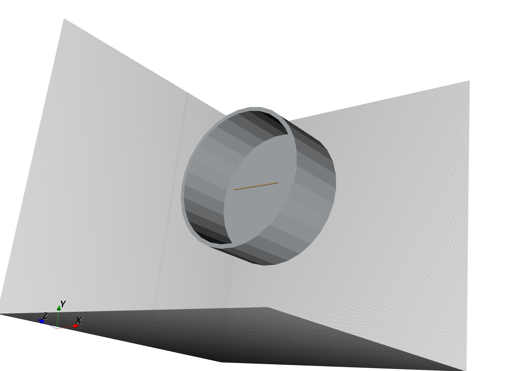
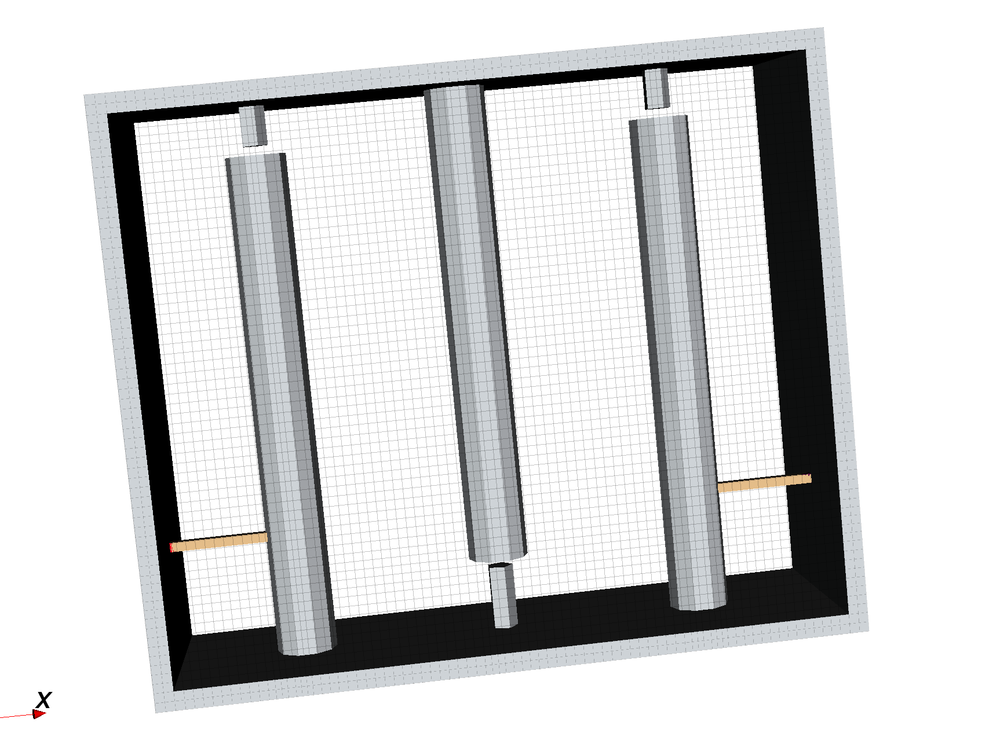

# Rfems

This script lets you run an openEMS FDTD simulation
from a collection of STL 3D models.  To use the script, first you need to
have openEMS installed as well as its Python API extension.  You 
will also need a method to generate the STL files that will compose your FDTD model.
The example models in this repo use Python and Openscad to do this.  But you can use whatever you want.

## How To Simulation Using Rfems

To create a simulation, generate a STL for every material or solid that you want
to be modeled.  The name of the STL indicates the type of material that composes
that solid.  So a file named 'aluminum.stl' will be considered to model a aluminum
part.  Rfems has preset material names of silver, copper, gold, aluminum, brass,
steel, pec, port, and air.  The material must start with this name.

Anything after this name will be considered a 'material variable'.
Material variables are key-value pairs separated by an equal sign.
To use a nonpreset material, with specific values for conductance and dielectic permittivity, use the
material variables kappa and epsilon.  For example, if your material has a conductance of 44.3e6
name your file 'kappa=44.3e6.stl'.  Otherwise, if no preset is used or no kappa or epsilon variables
are set, the material will be considered a perfect conductor, or PEC.

The port material is a special case.  Its STL model creates a lumped port in
openEMS.  The format of the port material is 'port {polarity} {port number}' where
polarity is either x, y, or z and port number starts from 1.
The lumped port's impedance defaults to the value provided
through the --line option.  Or you can set it directly using the 'zo' material
variable.  For example for a lumped port 1 with an impedance of 75 ohms use 'port x 1 zo=75'.
The bounding box of the STL model will be used as the lumped port's dimensions.

Multiple STL models using the same material
can be differentiated using labels: prefix the material with a label name and
then a dash, for example 'tee-aluminum.stl'.  In fact it is usually much easier to
create separate STL models for each component of the same material, like using
one STL model for each resonator in a cavity filter.  Sometimes it is 
even neccessary because of the limitation in openEMS.  For example a enclosure 
in openEMS must be have its lid, edges, and tops each in a separate file.  For a cup antenna the sides
of cup must be in a separate STL file than the bottom of the cup.  Use the option --dump to check.

To set the priority of the material use the material variable 'priority'.  For example
to set the priority of an aluminum STL model to 10 use, 'aluminum priority=10'.  The
default priority for materials is 0, the lowest priority.  A conductive material 
lying on top of a substrate material should have a higher priority set, see patch.py.

All these models must be then zipped up into a single zip file.  This zip file is
presented to rfems as the complete model to simulate.  To view the complete model use the --show option.

## S-parameter Support

After each simulation the s-parameter result is written out to a .npz numpy formatted
data file.  The s parameters are in the 's' variable, the frequency points are in
the 'f' variable.  The 'z' variable is an array of each port's characteristic impedance.

## Antenna Far Field Support

Rfems supports the generation of far field radiation patterns using the option
--farfield.  If the option --nominimum is NOT used, the far field pattern generated
is only for the frequency point of minimum VSWR.  Otherwise rfems computes the
far field patterns for all the simulation points. (The rfems default of 1000 frequency points
might take a while, so you probably want to change it.)
The radiation pattern is included in the .npz file output.
See the showresults.py file in the examples directory for the list of variables written
out (these are also the same variables generated by openEMS).

When enabling farfield, the boundary surrounding your model will switch from PEC
to MUR.  To put space between your antenna model and this MUR boundary create a STL model
and name it using the material name air.   See the examples, cup.py and patch.py for
examples of how this works.

## Dependencies

To run rfems:

1. openEMS binary libraries ($ apt-get install openems)
2. openEMS python libraries ($ apt-get install python3-openems)
3. numpy ($ pip install numpy)

To run the examples in the repo (optional):

1. solidpython2 ($ pip install solidpython2)
2. matplotlib ($ pip install matplotlib)
3. openscad ($ apt-get install openscad)

## Example

```
$ python examples/patch.py
$ unzip -l examples/patch.zip
Archive:  examples/patch.zip
  Length      Date    Time    Name
---------  ---------- -----   ----
     1719  1980-01-01 00:00   sim_box-air.stl
     1737  1980-01-01 00:00   patch-pec priority=10.stl
     1773  1980-01-01 00:00   ground-pec priority=10.stl
     1719  1980-01-01 00:00   substrate-epsilon=3.38 kappa=0.000460693.stl
     2025  1980-01-01 00:00   port z 1.stl
---------                     -------
     8973                     5 files
$ python rfems.py examples/patch.zip --pitch .005 --frequency 2e9 --criteria -40 --threads $(nproc) --farfield
$ python examples/showresult.py examples/patch.npz
```


```
$ python examples/inter.py \
    --rod 0.0006875 -0.001875 0.0006875 \
    --sep 0.0008125 0.0008125 \
    --tap 0.00492334 0.00492334 \
    --qe1 11.7818 11.7818 \
    --kij 0.0600168 0.0600168 \
    --freq 1.296e+09 --a 1 --b 3
$ unzip -l examples/inter.zip
Archive:  examples/inter.zip
  Length      Date    Time    Name
---------  ---------- -----   ----
     4185  1980-01-01 00:00   box tops-aluminum priority=10.stl
     4185  1980-01-01 00:00   box edges-aluminum priority=10.stl
     4149  1980-01-01 00:00   box lids-aluminum priority=10.stl
     6563  1980-01-01 00:00   rods1-aluminum priority=10.stl
     2043  1980-01-01 00:00   tap1-copper priority=5.stl
     2043  1980-01-01 00:00   port x 1.stl
     2973  1980-01-01 00:00   screw1-aluminum priority=10.stl
     6533  1980-01-01 00:00   rods2-aluminum priority=10.stl
     3005  1980-01-01 00:00   screw2-aluminum priority=10.stl
     6455  1980-01-01 00:00   rods3-aluminum priority=10.stl
     2007  1980-01-01 00:00   tap2-copper priority=5.stl
     2007  1980-01-01 00:00   port x 2.stl
     2925  1980-01-01 00:00   screw3-aluminum priority=10.stl
---------                     -------
    49073                     13 files
$ python rfems.py examples/inter.zip --freq 1.296e+09 --span 4.4e+08 --line 50 --threads 6 --pitch 0.001
$ python examples/showresult.py examples/inter.npz
```



## Usage

```
$ python rfems.py --help
usage: rfems.py [-h] [--pitch PITCH] [--frequency FREQ] [--span SPAN]
                [--points POINTS] [--start START] [--stop STOP] [--line LINE]
                [--farfield] [--dphi DPHI] [--dtheta DTHETA] [--nominimum]
                [--criteria CRITERIA] [--average] [--verbose VERBOSE]
                [--threads THREADS] [--show-model] [--dump-pec]
                input_filename [output_filename]

positional arguments:
  input_filename       input zip file of STL models
  output_filename      s-parameter and farfield .npz output file (default:
                       None)

optional arguments:
  -h, --help           show this help message and exit
  --pitch PITCH        length of a uniform yee cell side (m) (default: 0.001)
  --frequency FREQ     center simulation frequency (Hz) (default: None)
  --span SPAN          simulation span, -20dB passband ends (Hz) (default:
                       None)
  --points POINTS      measurement frequency points, set to 1 for center
                       frequency (default: 1000)
  --start START        first port to excite, starting from 1 (default: None)
  --stop STOP          last port to excite, starting from 1 (default: None)
  --line LINE          default characteristic impedance of ports (default: 50)

farfield options:
  --farfield           generate free-space farfield radiation patterns
                       (default: False)
  --dphi DPHI          azimuth increment (degree) (default: 2)
  --dtheta DTHETA      elevation increment (degree) (default: 2)
  --nominimum          do not find frequency of least VWSR (default: False)

openems options:
  --criteria CRITERIA  end criteria, eg -60 (dB) (default: None)
  --average            use cell material averaging (default: False)
  --verbose VERBOSE    openems verbose setting (default: 0)
  --threads THREADS    number of threads to use, 0 for all (default: 0)

debugging options:
  --show-model         run AppCSXCAD on input model, no simulation (default:
                       False)
  --dump-pec           generate PEC dump file and run ParaView on it (default:
                       False)
```

## Notes

Openscad cannot create STL models of planar surfaces.  As a work around, use a very small value for the flat dimension instead of zero.  Rfems flattens all STL files with bounding box dimensions less than or equal to 1e-6 m (or 1e-3 in STL units) to their planar 2D and 1D box equivalent.  See patch.py.  STL files are considered to use millimeter units.

